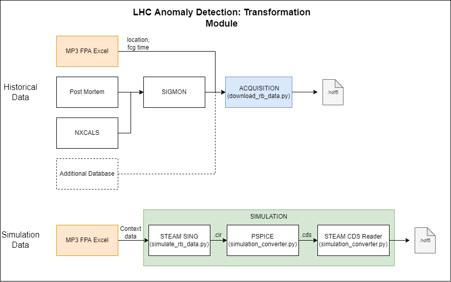

# Anomaly detection in the LHC RB circuit

Repository for analysis of fast power aborts in the LHC main dipole circuit with machine learning.


## Repository structure
```
├── data                                           > Context data used for analysis, big files are not stored on git
│ ├── RB_TC_extract_2021_11_22.xlsx                     > Unprocessed mp3 excel file with all FPA < 2021.11.22  
│ ├── RB_TC_extract_2021_11_22_processed.csv            > Cleaned mp3 file with fgc timestamps 
│ ├── RB_TC_extract_2021_11_22_processed_filled.csv     > Cleaned mp3 file with fgc timestamps & added features for simulation
│ ├── STEAM_context_data                                > Folder with data necessary for simulation with STEAM
│ └── transformation_overview.png                       > Picture with repository structure
├── notebooks                                      > Notebooks for code presentation
│ ├── RB_FPA_acquisition.ipynb                          > Notebook describing the data acquisition process
│ └── RB_FPA_event_analysis.ipynb                       > Notebook analyzing the mp3 excel file
├── references                                     > References used for analysis
│ ├── Local_TFM_analysis_report.pdf                     > Local Transfer Function Measurement Data Analysis
│ ├── Marvin_Thesis.pdf                                 > Framework for automatic superconducting magnet model generation 
│ │                                                       & validation against transients measured in LHCmagnets
│ ├── RB_QPS_Signals.png                                > Picture of QPS signals in RB circuit
│ └── RB_circuit.png                                    > Picture of RB circuit
├── scripts                                        > Scripts to execute for user
│ ├── download_rb_data.py                               > Script to download data
│ ├── simulate_rb_data.py                               > Script to simulate data
│ └── simulation_converter.py                           > Script to convert simulated .cir file to .hdf5
├── src                                            > Source files, used by the scripts and the notebooks
│ ├── acquisition.py                                    > Abstract acquisition class
│ ├── acquisitions                                      > Detailed acquisition files
│ ├── simulation.py                                     > Simulation file (from Marvin, to be outsourced)
│ ├── simulations                                       > Functions for simulation (from Marvin, to be outsourced)
│ ├── utils                                             > Utility functions hdf_tools, mp3_excel_processing, utils
│ └── visualisation                                     > Functions for visualisation
├── requirements.txt                               > Package requirements
└── README.md                                      > Git readme
```

### Generate venv requirements
```
pip install virtualenv
virtualenv venv 
source ./venv/bin/activate
pip install -r requirements.txt
```

# Transformation
The transformation module contains scripts to download and simulate signals in the LHC main dipole circuit.


## Acquisition
Access to the AccPy repo is necessary for installing NXCALS. Execution only on Linux.

### Run code outside SWAN:
Install necessary packages:
```
pip install git+https://gitlab.cern.ch/acc-co/devops/python/acc-py-pip-config.git
pip install nxcals
pip install lhcsmapi==1.5.20
```
Open mandatory ports and extend runtime:
```
sudo firewall-cmd --add-port=5001/tcp
sudo firewall-cmd --add-port=5101/tcp
sudo firewall-cmd --add-port=5201/tcp cern.2020
sudo firewall-cmd --runtime-to-permanent
firewall-cmd --list-ports
```
Start spark session:
```
from nxcals.spark_session_builder import get_or_create, Flavor
spark = get_or_create(flavor=Flavor.YARN_MEDIUM) # or any other flavor or dict with config
```

## Simulation
Execution only on Windows, as PSpice is utilized.
### Using steam sing
* Clone steam-notebooks directory: https://gitlab.cern.ch/steam/steam-notebooks.git and specify path bellow (commit sha: e591c2ebc6ea191fa8ed240cf7cc7361d1a3fae4)
* Required Programs: PSPICE, COSIM, and LEDET
* Contact emmanuele.ravaioli@cern.ch to get get access to COSIM and LEDET
* Create personal configurations in "steam-notebooks\steam-sing-input\resources\User configurations\config.\<user\>.yaml"
* Select signals to simulate in "steam-notebooks\steam-sing-input\resources\selectedSignals_RB.csv"

# Hints
### Create requirements
```
pip install pipreqs
pipreqs
```

### Autoformat python file
```
autopep8 --in-place --aggressive --aggressive <filename>
```
